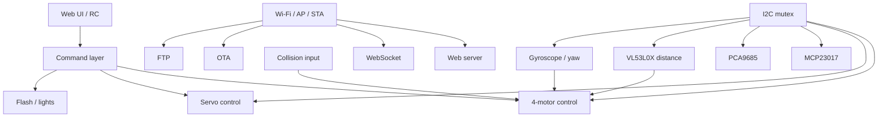

# Rover Control RTOS 2


ESP32-based rover firmware built around a **modular FreeRTOS architecture**.
It combines **4-wheel motion control**, **lateral mecanum movement**, **real-time web control**, **WebSocket telemetry**, **OTA**, **FTP**, and multiple onboard sensors for assisted driving and monitoring.

> This is not just a demo sketch: the project has been tuned on a real rover platform, including recent improvements to turning behavior and straight-line heading hold.

---

## Highlights

- **4-wheel independent drive control**
- **Forward and reverse curved steering**
- **In-place rotation** commands
- **Lateral motion** for mecanum wheels
- Optional **heading hold** when moving straight
- **FreeRTOS task-based architecture**
- Network modes: **STA + AP + RC**, **AP + RC**, or **RC only**
- **Web server** for rover control and monitoring
- **WebSocket** for real-time telemetry and commands
- **OTA updates**
- **FTP access** to onboard storage
- Sensor support for:
  - **VL53L0X** distance
  - **gyroscope / yaw feedback**
  - **DHT11** temperature and humidity
  - **human presence radar**
  - **collision sensor**
- I2C expansion using:
  - **MCP23017**
  - **PCA9685**
- Flash / lighting management
- **Radio control** integration

---

## System Overview



The firmware is split into independent modules coordinated by the main sketch. A key design choice is that all important I2C users are synchronized through a **shared mutex**, which reduces bus contention between motors, servos, sensors, and expanders.

---

## Main Modules

Typical modules used by the project:

- `wifi_connect.h`
- `ota.h`
- `sistema_ficheros.h`
- `giroscopio.h`
- `servomotores.h`
- `radar_vl53l0x.h`
- `4motores.h`
- `fecha_hora.h`
- `dht11.h`
- `servidor_web.h`
- `servidor_websocket.h`
- `servidor_ftp.h`
- `radio_control.h`
- `radar_humano.h`
- `mux_mcp23017.h`
- `mux_servos_pca9685.h`
- `flash_manager.h`

---

## Task Strategy

### Tasks that normally do **not** use I2C

- flash management
- DHT11 reading
- human presence radar
- radio control
- WebSocket server

### Tasks that **do** use I2C

- I2C bus initialization
- MCP23017 expander
- PCA9685 servo controller
- motor control
- servo control
- VL53L0X distance sensing
- gyroscope

Shared I2C access is protected with:

```cpp
SemaphoreHandle_t i2cMutex;
```

---

## Drive System

The rover uses a **4-motor drivetrain** with a logical motion layer that supports:

- straight forward / reverse
- curved forward left / right
- curved reverse left / right
- rotate left / right in place
- lateral left / right motion
- single-wheel diagnostic movement

### Logical wheel order used by `rover_move()`

```cpp
rover_move(dirDI, dirDD, dirTD, dirTI, speedDI, speedDD, speedTD, speedTI)
```

Where:

- `DI` = front left
- `DD` = front right
- `TD` = rear right
- `TI` = rear left

### Physical motor mapping

```text
motor 0 -> TI
motor 1 -> TD
motor 2 -> DI
motor 3 -> DD
```

This mapping matters when debugging wheel direction, PWM channels, or motor driver wiring.

---

## Steering Behavior

A recent improvement changed the rover from **abrupt turning** to **true curved steering**.

### Before
Some turn commands behaved too much like a pivot, making the rover turn very abruptly.

### Now
Forward and reverse turn commands keep **all four wheels active**, but reduce the speed on the inner side of the curve.

That produces:

- smoother cornering
- more predictable driving
- better separation between **curve** and **rotation in place**
- less aggressive turn response

### Dynamic curve strength

Curved steering now adapts automatically to speed:

- **low speed** → tighter turn
- **high speed** → smoother and more stable curve

Current tuning values in the motion code are approximately:

```cpp
const int   V_BAJA = 700;
const float K_BAJA = 0.40f;
const int   V_ALTA = 2500;
const float K_ALTA = 0.60f;
```

A fixed reference factor of `0.45f` is also kept as a practical tuning note from field testing.

---

## Heading Hold for Straight Motion

The motion system includes optional **heading hold** when the rover moves straight forward or backward.

When enabled, the rover stores a target heading and applies proportional correction using yaw feedback.

### Behavior

- active only for `forward` and `reverse`
- disabled automatically for lateral motion, curves, and rotation
- minimum speed threshold to avoid over-correction
- deadband to reduce oscillation
- bounded correction to keep control stable

### Current control constants

```cpp
static constexpr int   RUMBO_SPEED_MIN_CONTROL = 700;
static constexpr int   RUMBO_CORRECCION_MAX    = 700;
static constexpr float RUMBO_KP                = 18.0f;
static constexpr float RUMBO_DEADBAND_GRADOS   = 1.5f;
```

This helps the rover hold a straighter path when the platform, floor, or traction differences tend to pull it sideways.

---

## Safety / Obstacle Reactions

The motor layer also includes basic protective behavior:

- collision input can force flash hold behavior
- distance sensing can stop the rover when an obstacle is too close

At the moment, the rover is stopped when the measured radar distance is valid and is less than or equal to **150 mm**.

---

## Operating Modes

The firmware supports several operating modes through `modo_conex`.

### Mode 0 — `STA + AP + RC`

- Wi-Fi client connection
- access point fallback / coexistence
- file system
- web server
- WebSocket
- OTA
- FTP
- radio control

### Mode 1 — `AP + RC`

- own access point
- file system
- web server
- WebSocket
- OTA
- FTP
- radio control

### Mode 2 — `RC`

- radio-control-focused operation without the main network services

---

## Hardware Used

According to the current project structure, the rover uses or expects:

- **ESP32** main controller
- motor driver or power stage for **4 DC motors**
- **mecanum wheel** drive layout
- **PCA9685** PWM controller
- **MCP23017** GPIO expander
- **VL53L0X** distance sensor
- **gyroscope / yaw source**
- **DHT11** sensor
- **human presence radar**
- **collision input**
- flash / lighting outputs
- a suitable power supply for both logic and traction

---

## Build and Upload

This project is intended to be compiled from the **Arduino IDE** or another ESP32-compatible Arduino environment.

### Requirements

- Arduino IDE with ESP32 board package installed
- required project libraries installed
- all `.h` and `.cpp` files placed in the sketch folder or organized correctly

### Arduino IDE notes

Before compiling, make sure the board menu uses the proper partition layout for this project.

**Partition Scheme:** `Default 4 Mb with FFAT (1.2 MB APP/1.5 MB FATFS)`

This is important because the project uses **FFAT** and needs enough space for both the application and the onboard file system.

### Basic steps

1. Install ESP32 support in Arduino IDE.
2. Copy the full project into a single sketch folder.
3. Open the main `.ino` file in Arduino IDE.
4. Review `defines.h`:
   - pins
   - Wi-Fi credentials
   - connection mode
   - task priorities
   - stack sizes
5. Select the correct ESP32 board.
6. In **Tools → Partition Scheme**, select:
   - `Default 4 Mb with FFAT (1.2 MB APP/1.5 MB FATFS)`
7. Compile and upload.

### Recommended checks after upload

- confirm that FFAT mounts correctly
- verify that the web files are accessible
- verify Wi-Fi/AP startup behavior
- test motor movement with the rover lifted off the ground first

---

## Suggested Repository Layout

```text
rover_control_RTOS_2/
├── rover_control_RTOS_2.ino
├── defines.h
├── 4motores.h / .cpp
├── wifi_connect.h / .cpp
├── ota.h / .cpp
├── sistema_ficheros.h / .cpp
├── servidor_web.h / .cpp
├── servidor_websocket.h / .cpp
├── servidor_ftp.h / .cpp
├── giroscopio.h / .cpp
├── radar_vl53l0x.h / .cpp
├── servomotores.h / .cpp
├── radio_control.h / .cpp
├── radar_humano.h / .cpp
├── dht11.h / .cpp
├── mux_mcp23017.h / .cpp
├── mux_servos_pca9685.h / .cpp
├── flash_manager.h / .cpp
└── docs/
    ├── img/
    └── wiring/
```

---

## Configuration Notes

Things worth reviewing before publishing or deploying:

- Wi-Fi credentials
- AP/STA behavior
- FTP credentials
- OTA exposure
- task priorities and watchdog timing
- I2C timing and mutex use
- motor direction mapping
- heading-hold gains
- steering curve parameters

For real deployment, it is strongly recommended to:

- change hardcoded credentials
- restrict or disable FTP if not needed
- document wiring and power distribution
- version configuration changes

---

## Calibration Notes

### Steering

If the rover turns too abruptly:

- increase the inner-wheel curve factor
- raise `K_BAJA` or `K_ALTA`

If the rover turns too little:

- reduce the inner-wheel factor
- lower `K_BAJA`

### Heading hold

If it corrects too little:

- increase `RUMBO_KP`

If it oscillates or zigzags:

- reduce `RUMBO_KP`
- increase the deadband slightly

### Straight driving bias

If one axle or one side pushes harder than the other, a separate compensation layer may still be useful even with heading hold enabled.

---

## Screenshots / Photos

Add your rover photos and interface screenshots here:

```md


```

---

## Pinout / Wiring

This README intentionally avoids inventing a full pin map without the corresponding source files.

A good next step for the repository is to add:

- a motor driver wiring table
- I2C device addresses
- servo channel mapping
- sensor pin assignments
- a simplified block diagram of power distribution

---

## Roadmap

Possible future improvements:

- full pinout and wiring documentation
- task priority and timing map
- richer telemetry and diagnostics
- web-based configuration
- stronger authentication for network services
- structured logging per module
- per-module test procedures
- screenshots and field videos

---

## Project Status

Experimental and actively refined on a real rover platform.
The codebase is particularly oriented toward practical testing, incremental tuning, and modular ESP32 robotics development.

---

## License

Add the license you want to use, for example:

- MIT
- GPLv3
- Apache 2.0
- personal / non-commercial use

Example:

```text
This project is distributed under the MIT License.
```

---

## Authors

- **Ramón Lorenzo**
- **Diego Lorenzo**

You can expand this section with GitHub profiles, project photos, assembly notes, and demonstration videos.
