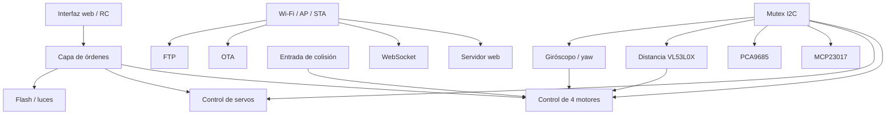

# Rover Control RTOS 2


Firmware para rover basado en **ESP32** y construido alrededor de una **arquitectura modular con FreeRTOS**.
Combina **control de movimiento de 4 ruedas**, **desplazamiento lateral con ruedas mecanum**, **control web en tiempo real**, **telemetría por WebSocket**, **OTA**, **FTP** y múltiples sensores a bordo para conducción asistida y monitorización.

> No se trata solo de un sketch de demostración: el proyecto ha sido ajustado sobre una plataforma de rover real, incluyendo mejoras recientes en el comportamiento de giro y en el mantenimiento de rumbo en línea recta.

---

## Características destacadas

- **Control independiente de 4 ruedas**
- **Giro en curva** hacia delante y hacia atrás
- Órdenes de **rotación sobre sí mismo**
- **Movimiento lateral** para ruedas mecanum
- **Mantenimiento de rumbo** opcional al avanzar en recta
- **Arquitectura basada en tareas FreeRTOS**
- Modos de red: **STA + AP + RC**, **AP + RC** o **solo RC**
- **Servidor web** para control y monitorización del rover
- **WebSocket** para telemetría y órdenes en tiempo real
- **Actualizaciones OTA**
- **Acceso FTP** al almacenamiento interno
- Soporte de sensores para:
  - **VL53L0X** de distancia
  - **giróscopo / realimentación de yaw**
  - **DHT11** de temperatura y humedad
  - **radar de presencia humana**
  - **sensor de colisión**
- Expansión I2C mediante:
  - **MCP23017**
  - **PCA9685**
- Gestión de flash / iluminación
- Integración de **radiocontrol**

---

## Visión general del sistema



El firmware está dividido en módulos independientes coordinados por el sketch principal. Una decisión clave de diseño es que todos los usuarios importantes del bus I2C se sincronizan mediante un **mutex compartido**, lo que reduce la contención entre motores, servos, sensores y expansores.

---

## Módulos principales

Módulos típicos utilizados por el proyecto:

- `wifi_connect.h`
- `ota.h`
- `sistema_ficheros.h`
- `giroscopio.h`
- `servomotores.h`
- `radar_vl53l0x.h`
- `4motores.h`
- `fecha_hora.h`
- `dht11.h`
- `servidor_web.h`
- `servidor_websocket.h`
- `servidor_ftp.h`
- `radio_control.h`
- `radar_humano.h`
- `mux_mcp23017.h`
- `mux_servos_pca9685.h`
- `flash_manager.h`

---

## Estrategia de tareas

### Tareas que normalmente **no** usan I2C

- gestión del flash
- lectura del DHT11
- radar de presencia humana
- radiocontrol
- servidor WebSocket

### Tareas que **sí** usan I2C

- inicialización del bus I2C
- expansor MCP23017
- controlador de servos PCA9685
- control de motores
- control de servos
- sensado de distancia VL53L0X
- giróscopo

El acceso compartido a I2C se protege con:

```cpp
SemaphoreHandle_t i2cMutex;
```

---

## Sistema de tracción

El rover utiliza una **transmisión de 4 motores** con una capa lógica de movimiento que soporta:

- avance / retroceso recto
- curva adelante izquierda / derecha
- curva atrás izquierda / derecha
- rotación izquierda / derecha sobre sí mismo
- desplazamiento lateral izquierda / derecha
- movimiento de rueda individual para diagnóstico

### Orden lógico de ruedas usado por `rover_move()`

```cpp
rover_move(dirDI, dirDD, dirTD, dirTI, speedDI, speedDD, speedTD, speedTI)
```

Donde:

- `DI` = delantera izquierda
- `DD` = delantera derecha
- `TD` = trasera derecha
- `TI` = trasera izquierda

### Mapeo físico de motores

```text
motor 0 -> TI
motor 1 -> TD
motor 2 -> DI
motor 3 -> DD
```

Este mapeo es importante al depurar el sentido de giro de las ruedas, los canales PWM o el cableado del driver de motores.

---

## Comportamiento de giro

Una mejora reciente cambió el rover de un **giro brusco** a una **dirección en curva real**.

### Antes
Algunas órdenes de giro se comportaban demasiado como un pivotaje, haciendo que el rover girase de forma muy brusca.

### Ahora
Las órdenes de giro hacia delante y hacia atrás mantienen **activas las cuatro ruedas**, pero reducen la velocidad en el lado interior de la curva.

Eso produce:

- paso por curva más suave
- conducción más predecible
- mejor separación entre **curva** y **rotación sobre sí mismo**
- respuesta menos agresiva al girar

### Intensidad dinámica de la curva

La dirección en curva se adapta ahora automáticamente a la velocidad:

- **baja velocidad** → giro más cerrado
- **alta velocidad** → curva más suave y estable

Los valores actuales de ajuste en el código de movimiento son aproximadamente:

```cpp
const int   V_BAJA = 700;
const float K_BAJA = 0.40f;
const int   V_ALTA = 2500;
const float K_ALTA = 0.60f;
```

Como referencia práctica de ajuste obtenida en pruebas reales, también se conserva el valor fijo `0.45f`.

---

## Mantenimiento de rumbo en movimiento recto

El sistema de movimiento incluye un **mantenimiento de rumbo** opcional cuando el rover avanza o retrocede en línea recta.

Cuando está activado, el rover almacena un rumbo objetivo y aplica una corrección proporcional utilizando la realimentación de yaw.

### Comportamiento

- activo solo en `forward` y `reverse`
- se desactiva automáticamente en movimiento lateral, curvas y rotación
- umbral mínimo de velocidad para evitar sobrecorrecciones
- banda muerta para reducir oscilaciones
- corrección limitada para mantener la estabilidad del control

### Constantes actuales de control

```cpp
static constexpr int   RUMBO_SPEED_MIN_CONTROL = 700;
static constexpr int   RUMBO_CORRECCION_MAX    = 700;
static constexpr float RUMBO_KP                = 18.0f;
static constexpr float RUMBO_DEADBAND_GRADOS   = 1.5f;
```

Esto ayuda al rover a mantener una trayectoria más recta cuando la plataforma, el suelo o las diferencias de tracción tienden a desviarlo lateralmente.

---

## Reacciones de seguridad / obstáculos

La capa de motores también incluye un comportamiento básico de protección:

- la entrada de colisión puede forzar el mantenimiento del flash
- la medida de distancia puede detener el rover cuando un obstáculo está demasiado cerca

En este momento, el rover se detiene cuando la distancia medida por el radar es válida y es menor o igual a **150 mm**.

---

## Modos de funcionamiento

El firmware soporta varios modos de funcionamiento mediante `modo_conex`.

### Modo 0 — `STA + AP + RC`

- conexión Wi-Fi como cliente
- punto de acceso de respaldo / coexistencia
- sistema de ficheros
- servidor web
- WebSocket
- OTA
- FTP
- radiocontrol

### Modo 1 — `AP + RC`

- punto de acceso propio
- sistema de ficheros
- servidor web
- WebSocket
- OTA
- FTP
- radiocontrol

### Modo 2 — `RC`

- funcionamiento centrado en radiocontrol sin los servicios principales de red

---

## Hardware utilizado

Según la estructura actual del proyecto, el rover utiliza o prevé:

- controlador principal **ESP32**
- driver de motores o etapa de potencia para **4 motores DC**
- disposición de tracción con **ruedas mecanum**
- controlador PWM **PCA9685**
- expansor GPIO **MCP23017**
- sensor de distancia **VL53L0X**
- **giróscopo / fuente de yaw**
- sensor **DHT11**
- **radar de presencia humana**
- **entrada de colisión**
- salidas de flash / iluminación
- una fuente de alimentación adecuada tanto para la lógica como para la tracción

---

## Compilación y carga

Este proyecto está pensado para compilarse desde el **Arduino IDE** o desde otro entorno Arduino compatible con ESP32.

### Requisitos

- Arduino IDE con el paquete de placas ESP32 instalado
- bibliotecas necesarias del proyecto instaladas
- todos los ficheros `.h` y `.cpp` colocados en la carpeta del sketch o correctamente organizados

### Notas para Arduino IDE

Antes de compilar, asegúrate de que el menú de la placa utiliza el esquema de partición adecuado para este proyecto.

**Partition Scheme:** `Default 4 Mb with FFAT (1.2 MB APP/1.5 MB FATFS)`

Esto es importante porque el proyecto usa **FFAT** y necesita espacio suficiente tanto para la aplicación como para el sistema de ficheros interno.

### Pasos básicos

1. Instala el soporte para ESP32 en Arduino IDE.
2. Copia el proyecto completo dentro de una única carpeta de sketch.
3. Abre el fichero principal `.ino` en Arduino IDE.
4. Revisa `defines.h`:
   - pines
   - credenciales Wi-Fi
   - modo de conexión
   - prioridades de tareas
   - tamaños de pila
5. Selecciona la placa ESP32 correcta.
6. En **Herramientas → Partition Scheme**, selecciona:
   - `Default 4 Mb with FFAT (1.2 MB APP/1.5 MB FATFS)`
7. Compila y carga.

### Comprobaciones recomendadas tras la carga

- confirmar que FFAT monta correctamente
- verificar que los ficheros web son accesibles
- verificar el arranque Wi-Fi/AP
- probar el movimiento de motores con el rover levantado del suelo al principio

---

## Estructura sugerida del repositorio

```text
rover_control_RTOS_2/
├── rover_control_RTOS_2.ino
├── defines.h
├── 4motores.h / .cpp
├── wifi_connect.h / .cpp
├── ota.h / .cpp
├── sistema_ficheros.h / .cpp
├── servidor_web.h / .cpp
├── servidor_websocket.h / .cpp
├── servidor_ftp.h / .cpp
├── giroscopio.h / .cpp
├── radar_vl53l0x.h / .cpp
├── servomotores.h / .cpp
├── radio_control.h / .cpp
├── radar_humano.h / .cpp
├── dht11.h / .cpp
├── mux_mcp23017.h / .cpp
├── mux_servos_pca9685.h / .cpp
├── flash_manager.h / .cpp
└── docs/
    ├── img/
    └── wiring/
```

---

## Notas de configuración

Aspectos que conviene revisar antes de publicar o desplegar:

- credenciales Wi‑Fi
- comportamiento AP/STA
- credenciales FTP
- exposición de OTA
- prioridades de tareas y temporización del watchdog
- temporización I2C y uso del mutex
- mapeo del sentido de giro de motores
- ganancias del mantenimiento de rumbo
- parámetros de la curva de giro

Para un despliegue real, se recomienda encarecidamente:

- cambiar las credenciales codificadas en duro
- limitar o desactivar FTP si no es necesario
- documentar cableado y distribución de alimentación
- versionar los cambios de configuración

---

## Notas de calibración

### Dirección

Si el rover gira demasiado bruscamente:

- aumenta el factor de la rueda interior en curva
- sube `K_BAJA` o `K_ALTA`

Si gira demasiado poco:

- reduce el factor de la rueda interior
- baja `K_BAJA`

### Mantenimiento de rumbo

Si corrige demasiado poco:

- aumenta `RUMBO_KP`

Si oscila o hace zigzag:

- reduce `RUMBO_KP`
- aumenta ligeramente la banda muerta

### Sesgo al avanzar recto

Si un eje o un lado empuja más que el otro, puede seguir siendo útil una capa adicional de compensación incluso con el mantenimiento de rumbo activado.

---

## Capturas / fotos

Añade aquí las fotos del rover y las capturas de la interfaz:

```md


```

---

## Pinout / cableado

Este README evita deliberadamente inventar un mapa completo de pines sin disponer de todos los ficheros fuente correspondientes.

Un buen siguiente paso para el repositorio sería añadir:

- una tabla de cableado del driver de motores
- direcciones I2C de los dispositivos
- mapeo de canales de servos
- asignación de pines de sensores
- un diagrama simplificado de distribución de potencia

---

## Hoja de ruta

Posibles mejoras futuras:

- documentación completa de pines y cableado
- mapa de prioridades y temporización de tareas
- telemetría y diagnóstico más ricos
- configuración desde la web
- autenticación más robusta para los servicios de red
- registro estructurado por módulos
- procedimientos de prueba por módulo
- capturas de pantalla y vídeos de campo

---

## Estado del proyecto

Experimental y en refinado activo sobre una plataforma de rover real.
La base de código está especialmente orientada a pruebas prácticas, ajuste incremental y desarrollo modular de robótica con ESP32.

---

## Licencia

Añade la licencia que quieras utilizar, por ejemplo:

- MIT
- GPLv3
- Apache 2.0
- uso personal / no comercial

Ejemplo:

```text
This project is distributed under the MIT License.
```

---

## Autores

- **Ramón Lorenzo**
- **Diego Lorenzo**

Puedes ampliar esta sección con perfiles de GitHub, fotos del proyecto, notas de montaje y vídeos de demostración.
